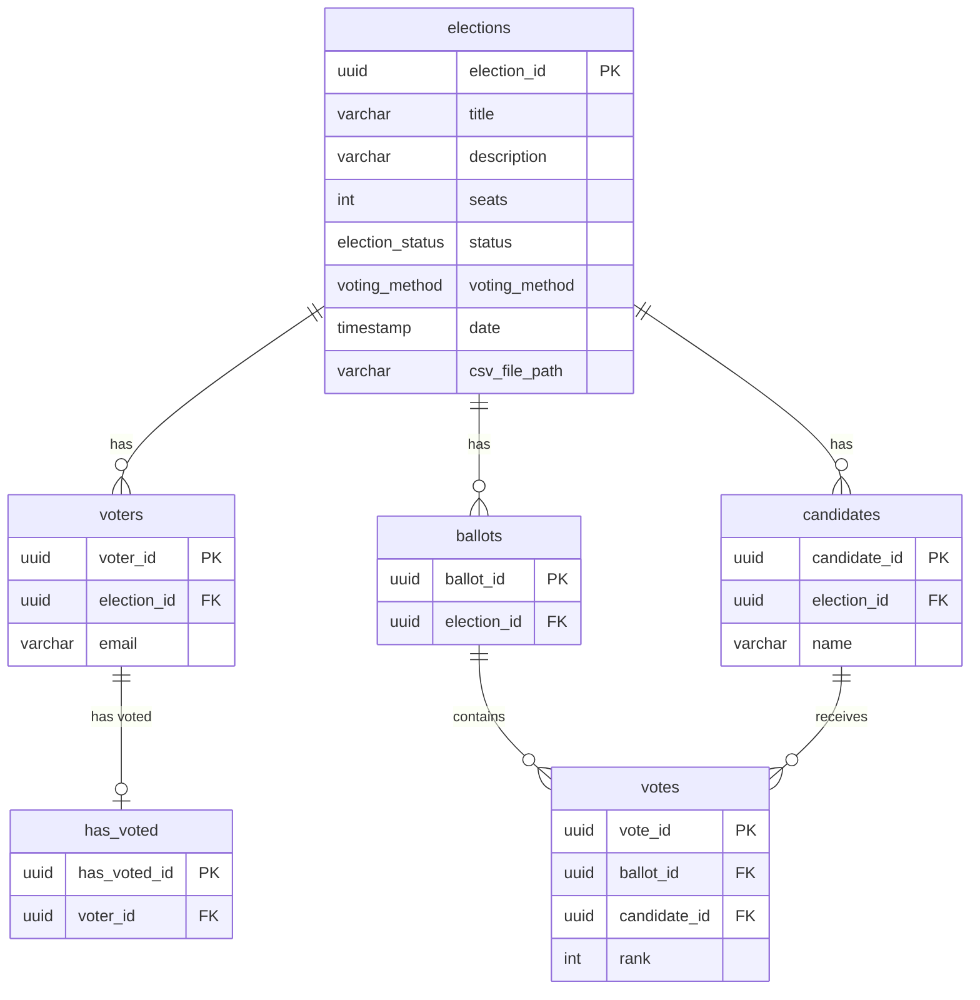

# Guild of Physics' Voting Machine

An electronic voting system for guild meetings. Supports **Single Transferable Vote (STV)** with Droop quota and **Plain Majority** voting methods.

## Quick Start

```bash
# 1. Clone and install
git clone https://github.com/fyysikkokilta/fk-vaalimasiina.git
cd fk-vaalimasiina
pnpm install

# 2. Configure environment
cp .env.example .env
# Edit .env — at minimum set DATABASE_URL, AUTH_SECRET, ADMIN_EMAILS, OAUTH_PROVIDERS + credentials

# 3. Set up database
pnpm db:migrate

# 4. Start development server
pnpm dev
```

See [docs/development.md](docs/development.md) for full development setup instructions.

## Documentation

| Guide                                  | Description                                 |
| -------------------------------------- | ------------------------------------------- |
| [Customization](docs/customization.md) | Branding, colors, logo, translations        |
| [Deployment](docs/deployment.md)       | Docker, CI/CD, production setup             |
| [OAuth Setup](docs/oauth-setup.md)     | Google, GitHub, Microsoft, custom providers |
| [Development](docs/development.md)     | Dev environment, testing, contributing      |

## Voting System Overview

The voting process operates as follows:

1. **Check-in** — A member attends the meeting and is marked present by the secretary.
2. **Voting Setup** — When voting begins, a list of member emails is entered into the system.
3. **Distributing Voting Links** — Each member receives a unique voting link by email.
4. **Casting Votes** — Members rank candidates in order of preference via their link. The system stores voter identity and ballot data in separate tables to ensure anonymity — after a vote is processed, it cannot be traced back to the voter.
5. **Ballot Confirmation** — Each member receives a unique ballot ID after voting.
6. **Displaying Results** — Once voting closes, results are calculated and shown.
7. **Auditing** — Members can verify their vote using the ballot ID in an auditing view.
8. **Closing** — The election is closed after results are reviewed. A new election can then be created.

## Result Calculation

The system uses the **STV algorithm** with the **Droop quota**:

$$\text{Quota} = \left\lfloor\frac{\text{Total Valid Votes}}{\text{Seats} + 1}\right\rfloor + 1$$

Steps:

1. Count first-preference votes
2. Elect candidates reaching the quota
3. Transfer surplus votes at a fractional transfer value
4. Eliminate the lowest candidate if no quota is reached; redistribute their votes
5. Repeat until all seats are filled

Tiebreaking uses a deterministic seeded shuffle based on the election UUID (same result on every run, but random per election). See [`src/algorithm/stvAlgorithm.ts`](src/algorithm/stvAlgorithm.ts) for the implementation.

For **Plain Majority** elections, the top N candidates by first-preference vote count are elected.

## Database Schema

The diagram below reflects the schema defined in [`src/db/schema.ts`](src/db/schema.ts) (Drizzle ORM, PostgreSQL).


